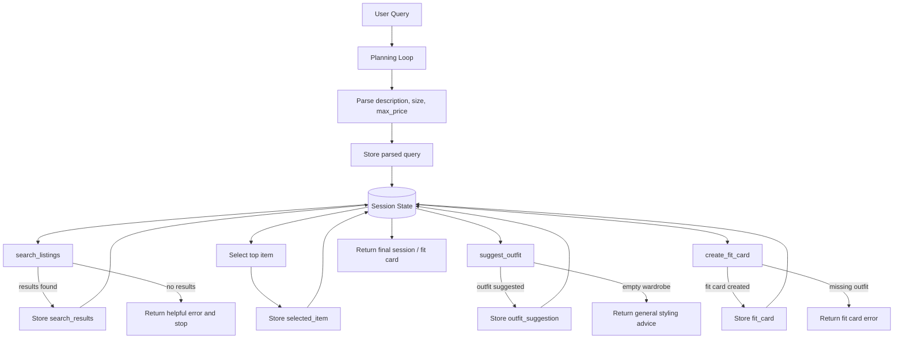

# FitFindr — planning.md

> Complete this document before writing any implementation code.
> Your spec and agent diagram are what you'll use to direct AI tools (Claude, Copilot, etc.) to generate your implementation — the more specific they are, the more useful the generated code will be.
> Your planning.md will be reviewed as part of your submission.
> Update it before starting any stretch features.

---

## Tools

List every tool your agent will use. For each tool, fill in all four fields.
You must have at least 3 tools. The three required tools are listed — add any additional tools below them.

### Tool 1: search_listings

**What it does:**
<!-- Describe what this tool does in 1–2 sentences -->
* Find clothing items that match a user's query by searching through a dataset of listings. It filters results based on criteria like description, size, and price.

**Input parameters:**
<!-- List each parameter, its type, and what it represents -->
- `description` (str): A text description of the clothing item the user is looking for.
- `size` (str, optional): The desired size of the clothing item. Case-insensitive and can be in various formats (e.g., "M", "W30", "W40 L20"). "M" matches any size that includes "M" (e.g., "M", "S/M"), but not sizes that do not include "M" (e.g., "S", "L").
- `max_price` (float, optional): The maximum price the user is willing to pay for the clothing item. It is inclusive, meaning items priced at exactly `max_price` should be included in the results.

**What it returns:**
<!-- Describe the return value — what fields does a result contain? -->
* A list of matching clothing items, where each item is represented as a dictionary:
     * With fields such as:
          - `title` (str): The title of the listing.
          - `description` (str): A description of the item.
          - `category` (str): The category of the item (e.g., "top", "bottoms", "shoes").
          - `style_tags` (list of str): Style tags associated with the item (e.g., "vintage", "streetwear").
          - `size` (str): The size of the item.
          - `condition` (str): The condition of the item.
          - `colors` (list of str): The colors of the item.
          - `price` (float): The price of the item.
          - `brand` (str): The brand of the item.
          - `platform` (str): The platform where the item is listed (e.g., "Depop", "Poshmark").
          - `score` (float): A relevance score indicating how well the item matches the search criteria by keyword overlap with `description`, with higher scores indicating better matches.
     * Sorted by relevance to the user's query, with the most relevant items appearing first. Exclude items with scores less than 1.
* Returns an empty list if no items match the search criteria.

**What happens if it fails or returns nothing:**
<!-- What should the agent do if no listings match? -->
<!-- Error path: If search_listings returns nothing, FitFindr tells the user what to try differently and stops — it does not call suggest_outfit with empty input. -->
* If no listings match the search criteria, the agent should inform the user that no items were found and provide suggestions on how to modify their search query for better results. For example, it could suggest broadening the description, removing the size filter, or increasing the maximum price. The agent should not proceed to call `suggest_outfit` if there are no search results, as it would not have a new item to work with.

---

### Tool 2: suggest_outfit

**What it does:**
<!-- Describe what this tool does in 1–2 sentences -->
* Suggests a complete outfit based on a new clothing item and the user's existing wardrobe. It analyzes the new item and finds complementary pieces from the user's wardrobe to create a cohesive look.

**Input parameters:**
<!-- List each parameter, its type, and what it represents -->
- `new_item` (dict): A dictionary representing the new clothing item, with fields such as `title`, `description`, `category`, `style_tags`, `size`, `condition`, `colors`, `price`, `brand`, and `platform`.
- `wardrobe` (dict): A dictionary representing the user's existing wardrobe, where the key is 'items' and a value is a list of dictionaries:
     - With fields such as:
          - `id` (str): A unique identifier for the item.
          - `name` (str): The short description of the item.
          - `category` (str): One of: "tops", "bottoms", "outerwear", "shoes", "accessories".
          - `colors` (list of str): The colors of the item.
          - `style_tags` (list of str): Style tags associated with the item (e.g., "vintage", "streetwear").
          - `notes` (str): Any additional notes about the item.
     - Default template for the wardrobe:
          ```
               {
                    "items": []
               }
          ```

**What it returns:**
<!-- Describe the return value -->
* A non-empty string describing a suggested outfit that incorporates the new item and complements it with pieces from the user's wardrobe. The suggestion should be specific and actionable, providing clear guidance on how to style the new item with existing pieces.

**What happens if it fails or returns nothing:**
<!-- What should the agent do if the wardrobe is empty or no outfit can be suggested? -->
* If the wardrobe is empty or no outfit can be suggested, the agent should provide general styling advice based on the new item alone. It can also encourage the user to add items to their wardrobe for better future suggestions and offer tips on how to build a versatile wardrobe that complements different styles.
* DO NOT return an empty string or raise an error. Always provide some form of styling advice, even if it's just based on the new item.

---

### Tool 3: create_fit_card

**What it does:**
<!-- Describe what this tool does in 1–2 sentences -->
* A short and sharable caption that describes the new outfit, including the new item and how it can be styled with the user's existing wardrobe. The fit card should be concise, engaging, and suitable for sharing on social media or with friends.

**Input parameters:**
<!-- List each parameter, its type, and what it represents -->
- `outfit` (str): A description of the suggested outfit.
- `new_item` (dict): A dictionary representing the new clothing item, with fields such as `title`, `description`, `category`, `style_tags`, `size`, `condition`, `colors`, `price`, `brand`, and `platform`.

**What it returns:**
<!-- Describe the return value -->
* A short, catchy caption (2–4 sentences) that highlights the new item and how it can be styled with the user's existing wardrobe. The caption should be engaging and suitable for sharing on social media.
* If outfit is empty or not provided, return a descriptive error message indicating that the fit card cannot be created without an outfit description.

**What happens if it fails or returns nothing:**
<!-- What should the agent do if the outfit data is incomplete? -->
* DO NOT raise an exception. Instead, return a descriptive error message indicating that the fit card cannot be created without an outfit description. The agent should then inform the user about the issue and suggest providing a complete outfit description to generate a fit card.

---

### Additional Tools (if any)

<!-- Copy the block above for any tools beyond the required three -->

---

## Planning Loop

**How does your agent decide which tool to call next?**
<!-- Describe the logic your planning loop uses. What does it look at? What conditions change its behavior? How does it know when it's done? -->
1. Call `search_listings` with the user's query parameters (description, size, max_price).
     1. If `search_listings` returns an empty list, break the loop and inform the user that no items were found, along with suggestions for modifying their search query.
     2. If `search_listings` returns results, the agent automatically selects the top-ranked result as the most relevant item. That item is stored in `session["selected_item"]` and passed directly into `suggest_outfit` as `new_item`.
2. Call `suggest_outfit` with that top-matching item and the user's wardrobe.
     1. If `suggest_outfit` returns a valid outfit description, proceed to the next step.
     2. If `suggest_outfit` fails to generate an outfit (e.g., due to an empty wardrobe), provide general styling advice based on the new item and encourage the user to add items to their wardrobe for better future suggestions.
3. Call `create_fit_card` with the outfit description and the new item.
     1. If `create_fit_card` returns a valid caption, present it to the user as the final output.
     2. If `create_fit_card` fails (e.g., due to incomplete outfit data), inform the user about the issue and suggest providing a complete outfit description to generate a fit card.
4. The agent is done after presenting the fit card or providing styling advice based on the new item if outfit generation fails.

---

## State Management

**How does information from one tool get passed to the next?**
<!-- Describe how your agent stores and accesses state within a session. What data is tracked? How is it passed between tool calls? -->
* The agent uses a session dictionary as the shared state for one full interaction. It stores `query`, `parsed`, `search_results`, `selected_item`, `wardrobe`, `outfit_suggestion`, `fit_card`, and `error`.
* After parsing the user query, the agent stores `description`, `size`, and `max_price` in `session["parsed"]`. After `search_listings`, the returned list is stored in `session["search_results"]`; if the list is empty, the agent sets `session["error"]` and returns early. If results exist, the first/top-ranked listing is stored in `session["selected_item"]` and passed into `suggest_outfit`.
* The outfit string returned by `suggest_outfit` is stored in `session["outfit_suggestion"]`. That value, along with `session["selected_item"]`, is passed into `create_fit_card`. The final caption is stored in `session["fit_card"]`, and the completed session is returned.

---

## Error Handling

For each tool, describe the specific failure mode you're handling and what the agent does in response.

| Tool | Failure mode | Agent response |
|------|-------------|----------------|
| search_listings | No results match the query | Stop the workflow before calling `suggest_outfit`. Tell the user no listings matched and suggest removing the size filter, raising max_price, or using broader keywords. |
| suggest_outfit | Wardrobe is empty | Still return a general outfit suggestion using only the new item, such as pairing it with common basics. Tell the user that adding wardrobe items would improve future suggestions. |
| create_fit_card | Outfit input is missing or incomplete | Return a clear error message instead of crashing. Tell the user that a fit card needs both a selected item and an outfit description. |

---

## Architecture

<!-- Draw a diagram of your agent showing how the components connect:
     User input → Planning Loop → Tools (search_listings, suggest_outfit, create_fit_card)
                                                                          ↕
                                                                   State / Session
     Show what triggers each tool, how state flows between them, and where error paths branch off.
     ASCII art, a Mermaid diagram (https://mermaid.js.org/syntax/flowchart.html), or an embedded
     sketch are all fine. You'll share this diagram with an AI tool when asking it to implement
     the planning loop and each individual tool. -->


---

## AI Tool Plan

<!-- For each part of the implementation below, describe:
     - Which AI tool you plan to use (Claude, Copilot, ChatGPT, etc.)
     - What you'll give it as input (which sections of this planning.md, your agent diagram)
     - What you expect it to produce
     - How you'll verify the output matches your spec before moving on

     "I'll use AI to help me code" is not a plan.
     "I'll give Claude my Tool 1 spec (inputs, return value, failure mode) and ask it to implement
     search_listings() using load_listings() from the data loader — then test it against 3 queries
     before trusting it" is a plan. -->

**Milestone 3 — Individual tool implementations:**
* *AI Tools:* Copilot for coding each tool, using the specific tool specs outlined above as input; ChatGPT for code review and testing guidance for each tool, using the tool specs and error handling sections as input.
* *Provided Input:* For each tool, provide the relevant section from this planning.md that describes the tool's functionality, input parameters, return values, and failure modes. Also provide the agent diagram to show how the tool fits into the overall architecture.
* *Expected Output:* Implemented functions for each tool that adhere to the specifications and handle the described failure modes.
* *Verification:* 
     * Test `search_listings` with a normal query, a size-filtered query, and a no-results query.
     * Test `suggest_outfit` with a populated wardrobe and with an empty wardrobe.
     * Test `create_fit_card` with a complete outfit description and with missing outfit data.

**Milestone 4 — Planning loop and state management:**
* *AI Tools:* Copilot for coding the planning loop and state management, using the overall architecture and tool specifications as input; ChatGPT for code review and testing guidance for the planning loop, using the architecture, planning loop logic, state management, and error handling sections as input.
* *Provided Input:* The overall architecture diagram and the tool specifications from this planning.md.
* *Expected Output:* Implemented planning loop and state management that correctly orchestrates tool calls and handles state transitions.
* *Verification:* 
     * Test a happy-path query and confirm all three tools are called in the correct order with the expected inputs and that the final output is correct.
     * Test a no-results query and confirm that the loop exits after `search_listings` and that the user receives the appropriate error message.
     * Test a query that results in an empty wardrobe and confirm that `suggest_outfit` returns general styling advice and that the user is informed about adding wardrobe items for better suggestions.
     * Inspect the session state to confirm `selected_item` and `outfit_suggestion` are passed between tools without user re-entry.

---

## A Complete Interaction (Step by Step)

Write out what a full user interaction looks like from start to finish — tool call by tool call. Use a specific example query.

**Example user query:** "I'm looking for a vintage graphic tee under $30. I mostly wear baggy jeans and chunky sneakers. What's out there and how would I style it?"

**Step 1:**
<!-- What does the agent do first? Which tool is called? With what input? -->
* *Input:* 
     * description = "vintage graphic tee"
     * size = None
     * max_price = 30.00
* *Initialize Session:*
```
session = {
     "query": "I'm looking for a vintage graphic tee under $30. I mostly wear baggy jeans and chunky sneakers. What's out there and how would I style it?",
     "parsed": {
          "description": "vintage graphic tee",
          "size": None,
          "max_price": 30.00
     },
     "search_results": [],
     "selected_item": None,
     "wardrobe": {
          "items": [
               {
                    "id": "1",
                    "name": "Baggy Jeans",
                    "category": "bottoms",
                    "colors": ["blue"],
                    "style_tags": ["casual", "streetwear"],
                    "notes": "Worn with chunky sneakers"
               },
               {
                    "id": "2",
                    "name": "Chunky Sneakers",
                    "category": "shoes",
                    "colors": ["white"],
                    "style_tags": ["casual", "streetwear"],
                    "notes": ""
               }
          ]
     },
     "outfit_suggestion": None,
     "fit_card": None,
     "error": None
}
```
* Call `search_listings` with the parsed query parameters. The tool searches through the dataset of listings and returns items that match the description "vintage graphic tee" and are priced under $30.00.
```python
     [
          {
               "title": "Vintage Band Tee — Faded Grey",
               "description": "Faded grey band-style tee with distressed graphic. Crew neck. Fits boxy. Well-loved but no holes or major damage.",
               "category": "tops",
               "style_tags": ["vintage", "grunge", "band tee", "graphic tee", "streetwear"],
               "size": "L",
               "condition": "fair",
               "price": 19.00,
               "colors": ["grey", "charcoal"],
               "brand": None,
               "platform": "depop"
          },
          {
               "title": "90s Cartoon Tee — Green",
               "description": "Bright green vintage tee featuring a classic '90s cartoon graphic. Soft cotton, crew neck, size M. Great condition with minimal signs of wear.",
               "category": "tops",
               "style_tags": ["vintage", "90s", "cartoon tee", "graphic tee", "streetwear"],
               "size": "M",
               "condition": "good",
               "price": 25.00,
               "colors": ["green"],
               "brand": None,
               "platform": "poshmark"
          }
     ]
```

State updates:
```python
     session["search_results"] = [
          {
               "title": "Vintage Band Tee — Faded Grey",
               "description": "Faded grey band-style tee with distressed graphic. Crew neck. Fits boxy. Well-loved but no holes or major damage.",
               "category": "tops",
               "style_tags": ["vintage", "grunge", "band tee", "graphic tee", "streetwear"],
               "size": "L",
               "condition": "fair",
               "price": 19.00,
               "colors": ["grey", "charcoal"],
               "brand": None,
               "platform": "depop",
               "score": 2.5
          },
          {
               "title": "90s Cartoon Tee — Green",
               "description": "Bright green vintage tee featuring a classic '90s cartoon graphic. Soft cotton, crew neck, size M. Great condition with minimal signs of wear.",
               "category": "tops",
               "style_tags": ["vintage", "90s", "cartoon tee", "graphic tee", "streetwear"],
               "size": "M",
               "condition": "good",
               "price": 25.00,
               "colors": ["green"],
               "brand": None,
               "platform": "poshmark",
               "score": 2.0
          }
     ]
     session["selected_item"] = {
          "title": "Vintage Band Tee — Faded Grey",
          "description": "Faded grey band-style tee with distressed graphic. Crew neck. Fits boxy. Well-loved but no holes or major damage.",
          "category": "tops",
          "style_tags": ["vintage", "grunge", "band tee", "graphic tee", "streetwear"],
          "size": "L",
          "condition": "fair",
          "price": 19.00,
          "colors": ["grey", "charcoal"],
          "brand": None,
          "platform": "depop"
     }
```

**Step 2:**
<!-- What happens next? What was returned from step 1? What tool is called now? -->
* Call `suggest_outfit` with the selected item (the vintage band tee) and the user's wardrobe (baggy jeans and chunky sneakers). The tool analyzes the new item and finds complementary pieces from the user's wardrobe to create a cohesive look.
```python
     "Pair the faded grey vintage band tee with your baggy jeans and chunky sneakers for a casual, retro look. Consider adding a denim jacket for an extra layer of style!"
```
* State update:
```python
     session["outfit_suggestion"] = "Pair the faded grey vintage band tee with your baggy jeans and chunky sneakers for a casual, retro look. Consider adding a denim jacket for an extra layer of style!"
```
**Step 3:**
<!-- Continue until the full interaction is complete -->
* Call `create_fit_card` with the outfit description and the new item. The tool generates a short, catchy caption that highlights the new item and how it can be styled with the user's existing wardrobe.
```python
     "Found this faded grey vintage band tee for $19 on Depop, and it’s giving easy retro streetwear. Pair it with baggy jeans and chunky sneakers for a relaxed, lived-in look that still feels intentional. Add a denim jacket if you want an extra layer."
```
* State update:
```python
     session["fit_card"] = "Found this faded grey vintage band tee for $19 on Depop, and it’s giving easy retro streetwear. Pair it with baggy jeans and chunky sneakers for a relaxed, lived-in look that still feels intentional. Add a denim jacket if you want an extra layer."
```
**Final output to user:**
<!-- What does the user actually see at the end? -->
"""
Top listing found:
Vintage Band Tee — Faded Grey
Price: $19.00
Size: L
Condition: Fair
Platform: Depop
Colors: Grey, Charcoal

Outfit suggestion:
Pair the faded grey vintage band tee with your baggy jeans and chunky sneakers for a casual, retro look. Consider adding a denim jacket for an extra layer of style!

Your fit card:
Found this faded grey vintage band tee for $19 on Depop, and it’s giving easy retro streetwear. Pair it with baggy jeans and chunky sneakers for a relaxed, lived-in look that still feels intentional. Add a denim jacket if you want an extra layer.
"""
